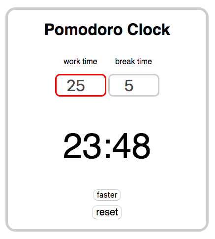

# Pomodoro Timer

A pomodoro timer made with JavaScript, HTML, and CSS.

Allows user to enter work and break times (takes mouse and key inputs). 

Plays a notification sound when a work period or a break period are up.

"Faster" button toggles speed to double time and back again.

"Reset" brings the timers back to default values at any time.